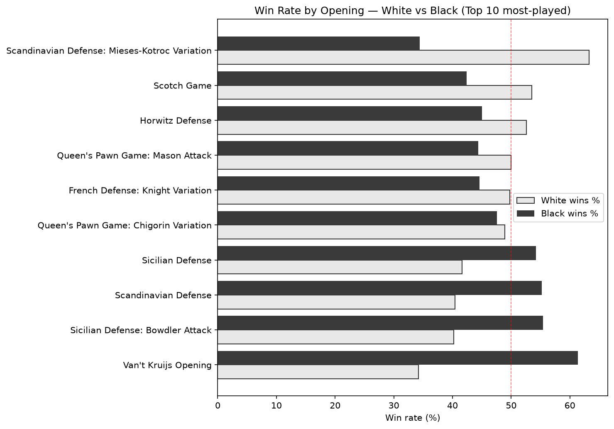
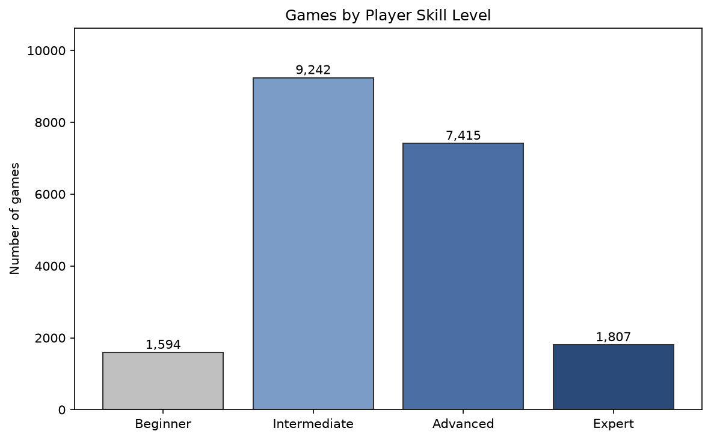
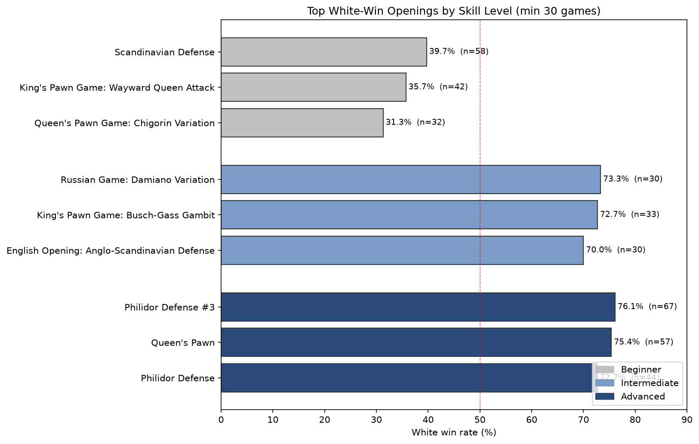

# Chess Opening Analysis — What Openings Win, and for Whom?

A SQL analysis of 20,058 online chess games (Lichess) exploring which
openings are played, which win, and how that changes with player skill.

**Tools:** MySQL 8.0 · **Data:** Lichess games dataset (Kaggle, ~20K games)

---

## Business Questions
1. Which openings are most popular, and does that differ by skill level?
2. Does White's first-move advantage actually show in the data?
3. Which openings favor White vs Black — and does that hold as players improve?
4. What should a player at a given level study?

## Key Findings

- **White's edge is real but modest** — White wins 49.9% overall vs Black's
  45.4%, with draws rare (4.7%) in this casual-level data.

- **Opening choice dwarfs the color advantage.** Win rates swing ~40 points
  by opening — from Black 71% to White 70% — far more than the flat 50/50
  color split suggests.

- **Opening choice is a fingerprint of skill.** Offbeat openings (Van't Kruijs)
  are a beginner marker (96 beginner games vs 2 expert); studied defenses
  (Caro-Kann) skew toward stronger players.

- **A methodological finding (the important one):** bracketing games by White's
  rating alone confounds skill with *matchmaking*. In "beginner" games, Black
  averages 200 rating points higher than White — which drives the low White
  win rate far more than opening choice does. Cross-checking a surprising
  result revealed the bracket definition, not the openings, was the real story.

## Visuals

**Win rate swings ~30 points by opening — far more than the flat color advantage:**

**The data concentrates in the middle brackets (why Expert findings are unreliable):**

**Best openings by skill level — note how win rates climb past 50% as skill rises:**

## Caveats & Limitations
- Bracketing uses White's rating only (see finding above) — a cleaner cut
  would bracket on both players.
- Expert-level opening performance isn't assessable — too few games per
  opening to reach a reliable sample.
- opening_name is granular; family-level rollup left as future work.

## Queries
| # | File | Focus | SQL demonstrated |
|---|------|-------|------------------|
| 1 | 01_popular_openings.sql | Opening popularity | GROUP BY, COUNT |
| 2 | 02_win_rate_by_color.sql | Color win rates | Conditional aggregation |
| 3 | 03_time_controls.sql | Win rates by time control | Grouped conditional agg, scalar subquery |
| 4 | 04_win_rate_by_opening.sql | Win rate per opening | Conditional agg + HAVING |
| 5 | 05_rating_brackets.sql | Skill distribution | CASE bucketing, window total |
| 6 | 06_opening_popularity_by_bracket.sql | Popularity by skill | Pivot with conditional counts |
| 7 | 07_win_rate_by_opening_bracket.sql | Performance by skill | Multi-column GROUP BY |
| 8 | 08_study_recommendations.sql | Best openings per level | CTEs + DENSE_RANK window |

## Data
Source: [Lichess games dataset, Kaggle](https://www.kaggle.com/datasets/datasnaek/chess).
Loaded into MySQL; see `data_setup/load_data.sql`.